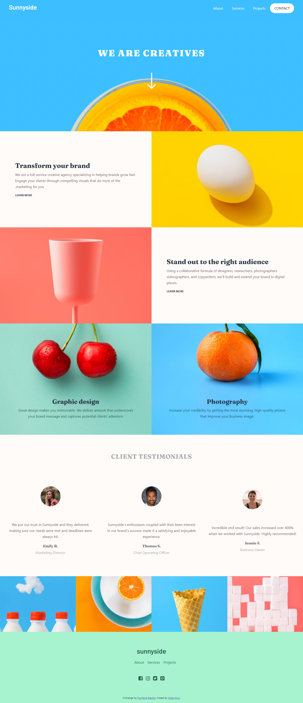

# Frontend Mentor - Sunnyside agency landing page

This is a solution to the [Sunnyside agency landing page challenge on Frontend Mentor](https://www.frontendmentor.io/challenges/sunnyside-agency-landing-page-7yVs3B6ef). 

### The challenge

Users should be able to:

- View the optimal layout for the site depending on their device's screen size
- See hover states for all interactive elements on the page

### Screenshot

### Links

- Solution URL: [Original Design](https://www.frontendmentor.io/challenges/sunnyside-agency-landing-page-7yVs3B6ef)
- Live Site URL: [My Finished Design](https://dazzling-fermi-a3ee80.netlify.app/)

### Built with

- Semantic HTML5 markup
- CSS

## Author

- Frontend Mentor - [@victorkirui](https://www.frontendmentor.io/profile/victorkirui)

